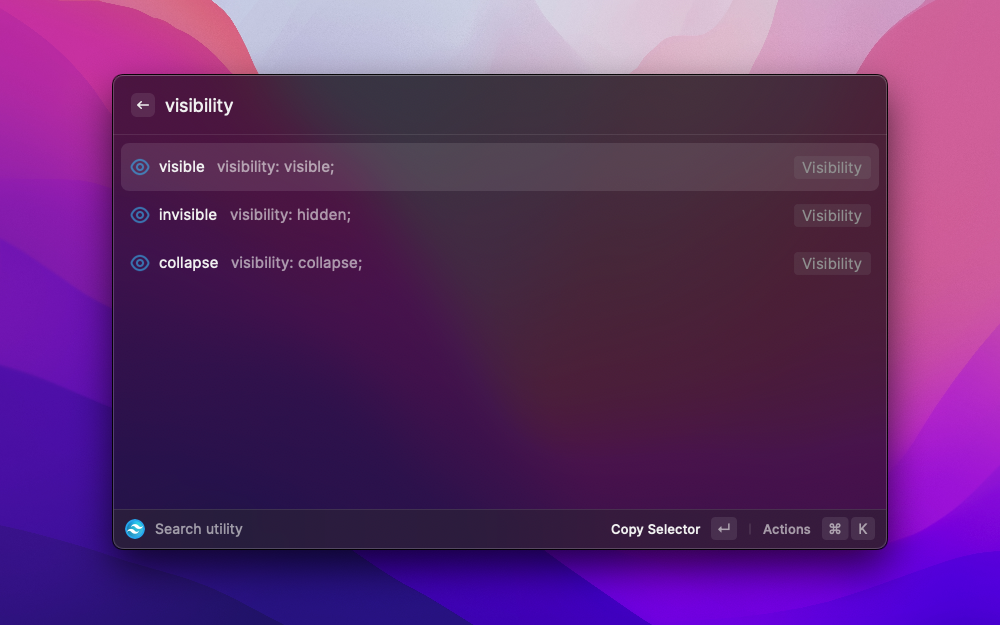

<h1 align="center">Tailwind Tools</h1>

<h3 align="center">
Work with your custom config organized with cute icons and some tools.
</h3>

## Features

### Search by name css or category

Search `.visible` with the dot to get the class `visible` or search `visibility` to get the class `visible` and `invisible` and `collapse`.

If you search for `border-radius` and you will get the classes `rounded`, `rounded-full`, ...

In addition, you can search by category, for example `Font`.

### Nice icons to describe the classes by category

The classes are organized in categories and have an icon assigned to make them easier to remember and above all they look pretty.

## Ideas and working on

- Work with your custom tailwind.config.js
- Convert css to Tailwind classes.
